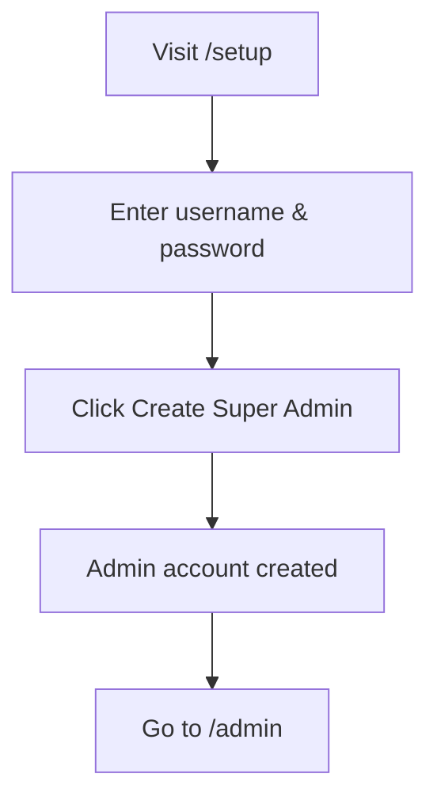
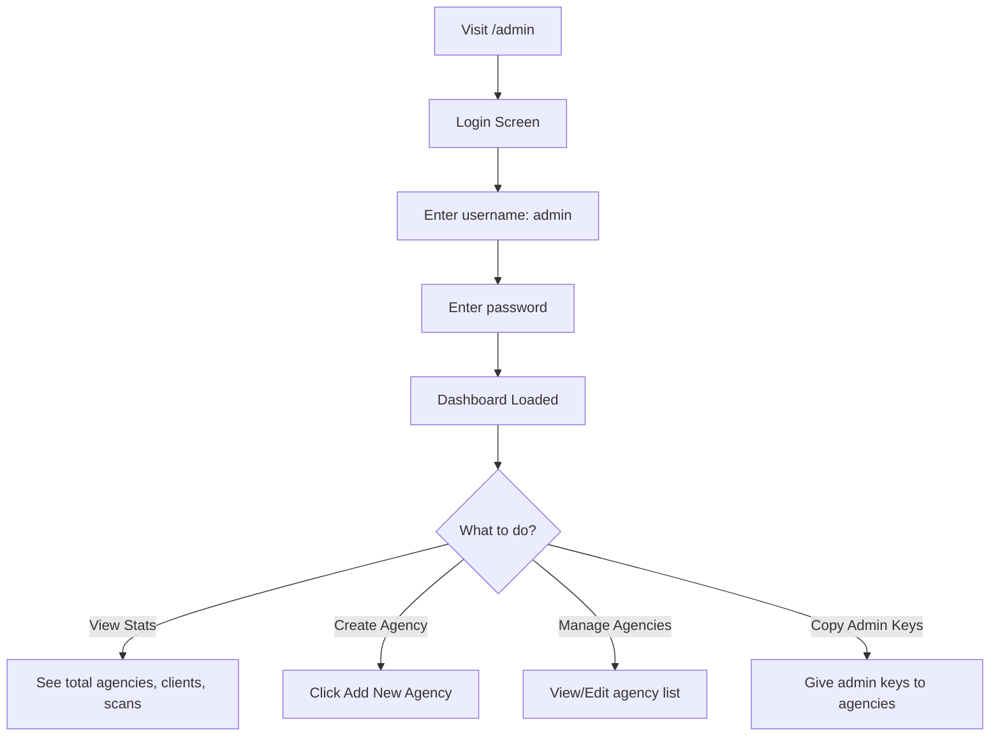
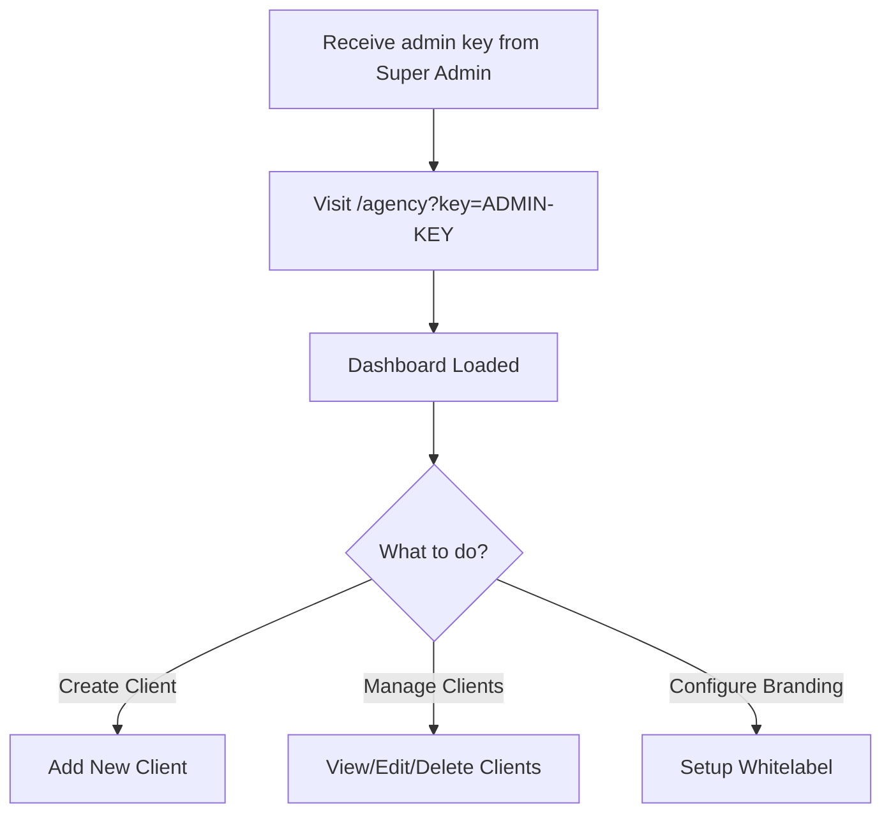
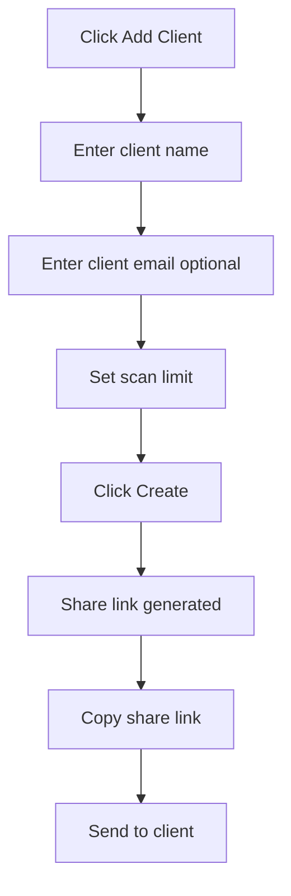
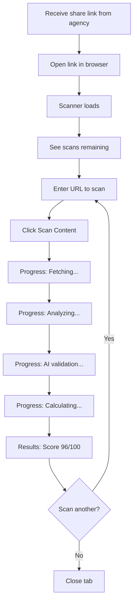
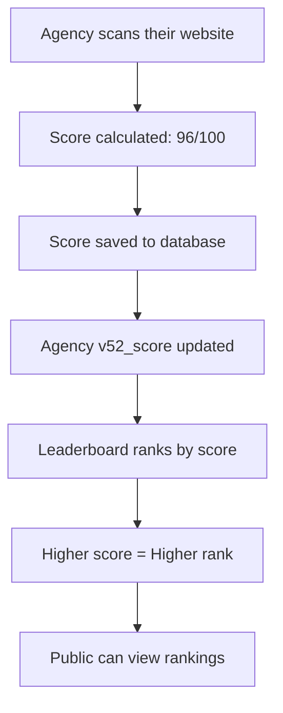

# 🎯 CONTENTSCALE PLATFORM - COMPLETE WORKFLOWS

**Version:** 2.0  
**Date:** December 10, 2025  
**Platform:** Railway + Neon + GitHub

---

## 📋 TABLE OF CONTENTS

1. [Platform URLs](#platform-urls)
2. [Super Admin Workflow](#super-admin-workflow)
3. [Agency Admin Workflow](#agency-admin-workflow)
4. [Client Workflow](#client-workflow)
5. [Leaderboard System](#leaderboard-system)
6. [API Endpoints](#api-endpoints)
7. [Testing & Configuration](#testing--configuration)

---

## 🌐 PLATFORM URLS

### **Production URL**
```
https://contentscale-platform-production.up.railway.app
```

### **Main Pages**

| Page | URL | Access |
|------|-----|--------|
| **Landing Page** | `/` | Public |
| **Health Check** | `/health` | Public |
| **Super Admin Setup** | `/setup` | Public (first time only) |
| **Super Admin Dashboard** | `/admin` | Login required (username + password) |
| **Agency Dashboard** | `/agency?key=ADMIN-KEY` | Agency admin key required |
| **Client Scanner** | `/seo-contentscore?key=SHARE-KEY` | Client share key required |
| **Leaderboard** | `/api/leaderboard/{country}` | Public API |

### **Countries for Leaderboard**
- `netherlands`
- `belgium`
- `germany`
- `uk`
- `usa`

**Example:**
```
https://contentscale-platform-production.up.railway.app/api/leaderboard/netherlands
```

---

## 👑 SUPER ADMIN WORKFLOW

**Role:** Platform owner (you!)  
**Access:** Username + Password authentication  
**Credentials:** `admin` / `AdminNieuw123`

### **First Time Setup**



**Steps:**

1. **Visit setup page:**
   ```
   https://YOUR-URL.up.railway.app/setup
   ```

2. **Create admin account:**
   - Username: `admin`
   - Password: `AdminNieuw123` (or your choice)
   - Click "Create Super Admin"

3. **Success!**
   - Admin account created
   - Click "Go to Admin Dashboard"

⚠️ **Important:** After creating admin, remove `/setup` page from production for security!

---

### **Daily Operations**



**Steps:**

1. **Login:**
   ```
   https://YOUR-URL.up.railway.app/admin
   ```
   - Username: `admin`
   - Password: `AdminNieuw123`

2. **View Dashboard:**
   - See stats (total agencies, clients, scans, active agencies)
   - View all agencies in table

3. **Create New Agency:**
   - Click "➕ Add New Agency"
   - Fill in:
     - **Name:** Agency name (e.g., "ContentScale")
     - **Domain:** Agency website (e.g., "contentscale.site")
     - **Country:** Select from dropdown
     - **Plan:** starter/professional/business/enterprise
     - **Whitelabel:** Enable if agency wants custom branding
   - Click "Create Agency"
   - **IMPORTANT:** Copy the admin key shown! Send to agency.

4. **Manage Agencies:**
   - View all agencies in table
   - See their scores, clients, scans
   - Copy admin keys (📋 button)
   - Monitor activity

5. **Logout:**
   - Click "Logout" button
   - Returns to login screen

---

### **Agency Plans Explained**

| Plan | Scans/Month | Whitelabel | Price Suggestion |
|------|-------------|------------|------------------|
| **Starter** | 100 | ❌ | €97/month |
| **Professional** | 500 | ✅ | €297/month |
| **Business** | 2,000 | ✅ | €797/month |
| **Enterprise** | Unlimited | ✅ | €1,997/month |

---

## 🏢 AGENCY ADMIN WORKFLOW

**Role:** SEO agency owner (your clients)  
**Access:** Admin key authentication  
**Example Key:** `admin-abc123def456xyz789`

### **Initial Access**



**Steps:**

1. **Get admin key from super admin**
   - Example: `admin-abc123def456xyz789`

2. **Access dashboard:**
   ```
   https://YOUR-URL.up.railway.app/agency?key=admin-abc123def456xyz789
   ```
   ⚠️ **Replace** `admin-abc123def456xyz789` with your actual key!

3. **Dashboard shows:**
   - Agency name and info
   - List of all clients
   - "Add Client" button
   - Whitelabel settings (if enabled)

---

### **Create Client**



**Steps:**

1. **Click "➕ Add Client"**

2. **Fill in form:**
   - **Client Name:** "Acme Corporation"
   - **Client Email:** optional (acme@example.com)
   - **Scan Limit:** 30 (or any number)

3. **Click "Create Client"**

4. **Copy share link:**
   ```
   https://YOUR-URL.up.railway.app/seo-contentscore?key=share-xyz123...
   ```

5. **Send link to client:**
   - Via email
   - Via WhatsApp
   - Via client portal
   - Client can scan immediately!

---

### **Manage Clients**

**Actions available:**

- **View all clients:** Table with name, email, scans used/limit
- **Copy share links:** Give to clients
- **Delete clients:** Remove access
- **Monitor usage:** See scans used

---

### **Whitelabel Configuration**

**If whitelabel is enabled:**

1. **Click "Configure Branding"**

2. **Set:**
   - **Brand Name:** Your agency name (replaces "ContentScale")
   - **Logo URL:** Your logo image URL
   - **Primary Color:** #4A9BFF (or your brand color)

3. **Save**

4. **Result:**
   - Client scanner shows YOUR brand
   - No "ContentScale" branding visible
   - Professional white-label experience

---

## 👥 CLIENT WORKFLOW

**Role:** End user (customers of agencies)  
**Access:** Share key (no login required)  
**Example Key:** `share-xyz789abc123`

### **Scanning Flow**



**Steps:**

1. **Receive link from agency:**
   ```
   https://YOUR-URL.up.railway.app/seo-contentscore?key=share-xyz789abc123
   ```

2. **Open link in browser**

3. **Scanner loads automatically:**
   - Shows agency branding (if whitelabel)
   - Shows client name
   - Shows scans remaining (e.g., "30 / 30")

4. **Enter URL:**
   ```
   https://example.com/article
   ```

5. **Click "🔍 Scan Content"**

6. **Wait 5-10 seconds:**
   - Progress animation shows:
     - 📥 Fetching content...
     - 🔍 Analyzing structure...
     - 🤖 AI validation...
     - 🎯 Calculating score...

7. **Results appear:**
   - **Large score:** 96/100 (color-coded)
   - **Quality:** EXCELLENT
   - **Breakdown:**
     - GRAAF: 48/50
     - CRAFT: 28/30
     - Technical: 20/20
   - **Scans remaining updated:** 29 / 30

8. **Scan another or finish**

---

### **Score Interpretation**

| Score | Quality | Color | Meaning |
|-------|---------|-------|---------|
| 90-100 | EXCELLENT | 🟢 Green | Outstanding content |
| 80-89 | GOOD | 🔵 Blue | Strong content |
| 70-79 | AVERAGE | 🟡 Yellow | Decent content |
| 60-69 | BELOW AVERAGE | 🟠 Orange | Needs improvement |
| 0-59 | POOR | 🔴 Red | Major issues |

---

### **What Happens When Limit Reached?**

**Scenario:** Client used all 30 scans

1. **Try to scan again**
2. **Error message:**
   ```
   You have reached your scan limit. 
   Please contact your agency for more scans.
   ```
3. **Client contacts agency**
4. **Agency increases limit or creates new share link**

---

## 🏆 LEADERBOARD SYSTEM

### **How It Works**



### **Key Concepts**

**V52 Score:**
- Each agency has ONE v52_score (0-100)
- This is their "official" agency ranking score
- Updated when agency scans their own domain
- Used for leaderboard rankings

**How Agencies Update Score:**

1. **Agency scans their website:**
   ```
   POST /api/scan-agency
   {
     "agencyId": 1,
     "url": "https://contentscale.site"
   }
   ```

2. **Score calculated:** 96/100

3. **Database updated:**
   ```sql
   UPDATE agencies 
   SET v52_score = 96, 
       last_scanned = NOW()
   WHERE id = 1;
   ```

4. **Leaderboard reflects new score immediately**

---

### **Viewing Leaderboard**

**Public API endpoint:**
```
GET /api/leaderboard/{country}
```

**Examples:**

```bash
# Netherlands leaderboard
https://YOUR-URL.up.railway.app/api/leaderboard/netherlands

# Germany leaderboard
https://YOUR-URL.up.railway.app/api/leaderboard/germany

# UK leaderboard
https://YOUR-URL.up.railway.app/api/leaderboard/uk
```

**Response:**
```json
{
  "success": true,
  "country": "netherlands",
  "total": 3,
  "agencies": [
    {
      "rank": 1,
      "id": 1,
      "name": "ContentScale",
      "domain": "contentscale.site",
      "country": "netherlands",
      "v52_score": "96.00",
      "last_scanned": "2025-12-10T18:45:12.000Z"
    },
    {
      "rank": 2,
      "id": 3,
      "name": "German SEO Agentur",
      "domain": "seo-agentur.de",
      "country": "netherlands",
      "v52_score": "88.00",
      "last_scanned": "2025-12-10T15:30:00.000Z"
    },
    {
      "rank": 3,
      "id": 2,
      "name": "Test SEO Agency",
      "domain": "testseo.com",
      "country": "netherlands",
      "v52_score": "75.00",
      "last_scanned": null
    }
  ]
}
```

---

### **Leaderboard Ranking Logic**

**Primary sort:** v52_score (descending - highest first)  
**Secondary sort:** last_scanned (descending - most recent first)

**SQL query:**
```sql
SELECT 
  id, name, domain, country, v52_score, last_scanned
FROM agencies 
WHERE country = 'netherlands' 
  AND is_active = true
ORDER BY 
  v52_score DESC,
  last_scanned DESC
LIMIT 100;
```

**Rank assignment:**
- Rank 1 = Highest score
- Rank 2 = Second highest
- Etc.

---

### **Leaderboard Use Cases**

**1. Public Rankings Page**
- Show top 10 agencies per country
- Gamification: "Climb the rankings!"
- Marketing: "We're #1 in Netherlands!"

**2. Agency Competition**
- Agencies compete for top spots
- Incentive to improve content quality
- Regular updates keep agencies engaged

**3. Marketing Tool**
- "Top-ranked SEO agencies"
- Social proof for potential clients
- Badge: "Ranked #1 by ContentScale"

---

### **Current Leaderboard Data**

**Netherlands:**
1. ContentScale - 96/100
2. German SEO Agentur - 88/100
3. Test SEO Agency - 75/100

**To update agency score:**

**Option A: Via Agency Dashboard** (not yet implemented)
- Agency admin can scan their own domain
- Score updates automatically

**Option B: Via API** (working now)
```bash
curl -X POST https://YOUR-URL.up.railway.app/api/scan-agency \
  -H "Content-Type: application/json" \
  -d '{
    "agencyId": 1,
    "url": "https://contentscale.site"
  }'
```

**Option C: Via Super Admin** (manual)
```sql
UPDATE agencies 
SET v52_score = 95, last_scanned = NOW() 
WHERE id = 1;
```

---

## 🔌 API ENDPOINTS

### **Public Endpoints**

| Method | Endpoint | Description | Auth |
|--------|----------|-------------|------|
| GET | `/` | API info | None |
| GET | `/health` | Health check | None |
| POST | `/api/scan-free` | Free public scan | None |
| GET | `/api/leaderboard/:country` | Rankings | None |

### **Setup Endpoints**

| Method | Endpoint | Description | Auth |
|--------|----------|-------------|------|
| GET | `/setup` | Setup page | None |
| POST | `/api/setup/create-admin` | Create super admin | None |
| POST | `/api/setup/verify-admin` | Verify login | Username+Password |

### **Super Admin Endpoints**

| Method | Endpoint | Description | Auth |
|--------|----------|-------------|------|
| GET | `/api/super-admin/agencies` | List all agencies | None* |
| POST | `/api/super-admin/agencies` | Create agency | None* |
| PATCH | `/api/super-admin/agencies/:id` | Update agency | None* |

*Should add authentication in production!

### **Agency Admin Endpoints**

| Method | Endpoint | Description | Auth |
|--------|----------|-------------|------|
| GET | `/api/admin/agency/my-agency` | Get agency info | x-agency-key header |
| GET | `/api/admin/agency/my-clients` | List clients | x-agency-key header |
| POST | `/api/admin/agency/my-clients` | Create client | x-agency-key header |
| DELETE | `/api/admin/agency/my-clients/:id` | Delete client | x-agency-key header |
| POST | `/api/admin/agency/my-agency/whitelabel` | Update branding | x-agency-key header |

### **Client Endpoints**

| Method | Endpoint | Description | Auth |
|--------|----------|-------------|------|
| GET | `/api/client/info?key=` | Get client info | Share key in URL |
| POST | `/api/client/scan` | Scan URL | Share key in body |

### **Agency Scanning** (for leaderboard)

| Method | Endpoint | Description | Auth |
|--------|----------|-------------|------|
| POST | `/api/scan-agency` | Scan agency domain | None* |

*Should add authentication!

---

## 🧪 TESTING & CONFIGURATION

### **Change Scan Frequency (Weekly → Hourly)**

**For testing, you want faster scans!**

#### **Option 1: Manual Database Updates**

**In Neon SQL Editor:**

```sql
-- Update agency scores every hour (manual)
UPDATE agencies 
SET v52_score = v52_score + 1,  -- Increment score
    last_scanned = NOW()
WHERE id = 1;

-- Or set specific score
UPDATE agencies 
SET v52_score = 95,
    last_scanned = NOW()
WHERE id = 1;
```

**Run this query every hour to simulate regular updates!**

---

#### **Option 2: Automatic Cron Job**

**If you want AUTOMATIC hourly scans:**

**Create file:** `scripts/auto-scan-agencies.js`

```javascript
// Auto-scan agencies every hour
const { Pool } = require('pg');
const axios = require('axios');

const pool = new Pool({
  connectionString: process.env.DATABASE_URL,
  ssl: { rejectUnauthorized: false }
});

async function scanAllAgencies() {
  console.log('🔍 Starting auto-scan...');
  
  try {
    // Get all active agencies
    const result = await pool.query(
      'SELECT id, domain FROM agencies WHERE is_active = true'
    );
    
    for (const agency of result.rows) {
      console.log(`📊 Scanning ${agency.domain}...`);
      
      try {
        // Call scan API
        const response = await axios.post(
          'http://localhost:3000/api/scan-agency',
          {
            agencyId: agency.id,
            url: `https://${agency.domain}`
          }
        );
        
        console.log(`✅ ${agency.domain}: ${response.data.score}/100`);
        
      } catch (error) {
        console.error(`❌ ${agency.domain} failed:`, error.message);
      }
      
      // Wait 30 seconds between scans (avoid rate limits)
      await new Promise(resolve => setTimeout(resolve, 30000));
    }
    
    console.log('✅ Auto-scan complete!');
    
  } catch (error) {
    console.error('❌ Auto-scan error:', error);
  }
  
  await pool.end();
}

scanAllAgencies();
```

**Add to package.json:**
```json
{
  "scripts": {
    "start": "node src/server.js",
    "auto-scan": "node scripts/auto-scan-agencies.js"
  }
}
```

**Run manually:**
```bash
npm run auto-scan
```

**Or schedule with cron (on your server):**
```bash
# Add to crontab: Run every hour
0 * * * * cd /app && npm run auto-scan
```

---

#### **Option 3: Railway Cron Jobs**

**Railway supports cron services!**

1. **Create new service in Railway**
2. **Type:** Cron Job
3. **Schedule:** `0 * * * *` (every hour)
4. **Command:** `npm run auto-scan`
5. **Deploy**

**Result:** Agencies automatically scanned every hour!

---

### **Testing Scan Timing**

**Quick test (5 minutes):**

```sql
-- Scan 1: Initial
UPDATE agencies SET v52_score = 85, last_scanned = NOW() WHERE id = 1;
SELECT * FROM agencies WHERE id = 1;

-- Wait 5 minutes...

-- Scan 2: Update
UPDATE agencies SET v52_score = 88, last_scanned = NOW() WHERE id = 1;
SELECT * FROM agencies WHERE id = 1;

-- Check leaderboard
SELECT name, v52_score, last_scanned 
FROM agencies 
WHERE country = 'netherlands' 
ORDER BY v52_score DESC;
```

**Result:** You'll see timestamps updated and rankings change!

---

### **Scan Frequency Recommendations**

| Use Case | Frequency | Method |
|----------|-----------|--------|
| **Production** | Weekly/Monthly | Manual or cron |
| **Testing** | Hourly/Daily | Manual SQL or cron |
| **Demo** | On-demand | Manual API calls |
| **Competition** | Weekly | Scheduled cron |

---

### **Testing Client Scanner**

**Quick test:**

1. **Get share key from agency dashboard**
2. **Open scanner:**
   ```
   https://YOUR-URL.up.railway.app/seo-contentscore?key=SHARE-KEY
   ```
3. **Scan these URLs:**
   ```
   https://contentscale.site
   https://anthropic.com
   https://openai.com
   ```
4. **Check different scores!**

---

### **Environment Variables for Testing**

**In Railway dashboard:**

```env
# Production
NODE_ENV=production
ANTHROPIC_API_KEY=sk-ant-...
DATABASE_URL=postgresql://...
PORT=3000

# Testing (optional)
ENABLE_DEBUG_LOGS=true
SCAN_TIMEOUT=30000
MAX_SCANS_PER_MINUTE=10
```

---

## 📊 COMPLETE USER JOURNEY MAP

```
SUPER ADMIN (You)
    ↓ /setup
    ↓ Create admin account (admin / AdminNieuw123)
    ↓ /admin
    ↓ Login
    ↓ Click "Add Agency"
    ↓ Create agency: ContentScale
    ↓ Copy admin key: admin-abc123xyz...
    ↓ Send key to ContentScale

AGENCY ADMIN (ContentScale)
    ↓ Receives admin key
    ↓ /agency?key=admin-abc123xyz...
    ↓ Click "Add Client"
    ↓ Create client: Acme Corp (30 scans)
    ↓ Copy share link: /seo-contentscore?key=share-xyz789...
    ↓ Send link to Acme Corp

CLIENT (Acme Corp)
    ↓ Receives share link
    ↓ Opens link in browser
    ↓ Sees: "Scans remaining: 30/30"
    ↓ Enters URL: https://acme.com/blog/post
    ↓ Clicks "Scan Content"
    ↓ Waits 5-10 seconds
    ↓ Results: 92/100 - EXCELLENT
    ↓ Breakdown: GRAAF 46/50, CRAFT 28/30, Technical 18/20
    ↓ "Scans remaining: 29/30"
    ↓ Scans another URL or closes
    ✅ HAPPY CLIENT!

MEANWHILE...
    ↓ Agency scans contentscale.site
    ↓ Score: 96/100 saved
    ↓ Leaderboard updated
    ↓ ContentScale = Rank #1 in Netherlands
    🏆 PUBLIC RECOGNITION!
```

---

## 🎯 QUICK REFERENCE URLS

**Copy-paste these URLs (replace YOUR-URL):**

```bash
# Super Admin
https://YOUR-URL.up.railway.app/admin

# Agency Dashboard (need key)
https://YOUR-URL.up.railway.app/agency?key=ADMIN-KEY

# Client Scanner (need key)
https://YOUR-URL.up.railway.app/seo-contentscore?key=SHARE-KEY

# Netherlands Leaderboard
https://YOUR-URL.up.railway.app/api/leaderboard/netherlands

# Health Check
https://YOUR-URL.up.railway.app/health

# API Info
https://YOUR-URL.up.railway.app/
```

---

## 📝 MAINTENANCE TASKS

### **Daily**
- Monitor Railway logs for errors
- Check database connections
- Verify scans are processing

### **Weekly**
- Update agency v52_scores (scan their domains)
- Review leaderboard rankings
- Check client scan usage

### **Monthly**
- Review agency plans
- Update pricing/limits if needed
- Backup database (Neon does this automatically)

### **As Needed**
- Create new agencies
- Reset client scan limits
- Update whitelabel settings
- Troubleshoot issues

---

## 🚀 SUCCESS METRICS

**Platform is working if:**

✅ Super admin can login  
✅ Agencies can be created  
✅ Clients can be created  
✅ Scanner returns scores  
✅ Scans are tracked in database  
✅ Leaderboard shows rankings  
✅ No errors in Railway logs  

---

## 🆘 TROUBLESHOOTING

**Scanner not working?**
- Check Railway logs
- Verify ANTHROPIC_API_KEY is set
- Test /health endpoint
- Check database connection

**Leaderboard empty?**
- Agencies need v52_scores
- Run manual scans via API
- Check country filter

**Client can't scan?**
- Verify share key is correct
- Check scan limit not reached
- Check client is_active = true

**Admin can't login?**
- Verify username/password
- Check super_admins table has entry
- Try password reset via /setup (after deleting old admin)

---

## 📞 SUPPORT

**Railway Issues:**  
https://railway.app → Deployments → View Logs

**Neon Database:**  
https://console.neon.tech → SQL Editor

**GitHub Repository:**  
github.com/YOUR-USERNAME/contentscale-platform

**API Documentation:**  
GET / for full endpoint list

---

**Last Updated:** December 10, 2025  
**Platform Version:** 2.0  
**Status:** ✅ Production Ready
